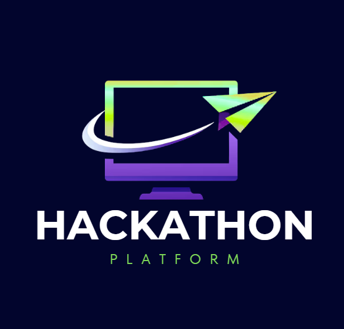

# Hackathon Platform - Keyboard Gremlins



### A cloud-agnostic, full-stack event management platform that is pupose-build for deterministic optimization challenges. This platform automates the entire hackathons lifecycle, from highly configurable event setups, particpant registaritons and team formation to execution. Submission are dynamically queued and processed by a scalable pool of parallel scoring workers, this allows the official grading solver to evaluate, score and log outputs in ral-time to drive dynamic live leaderboards. Engineered with a modular Spring Boot backend and a desktop-first, mobile-friendly Angular frontend. The system also supports dymanic runtime solver updates by the event orgranisers and scales scales such that it can handle peak submission spikes near competition deadlines.

## Badges

[](https://github.com/COS301-SE-2026/Hackathon-Platform/actions/workflows/ci.yml)

[](https://github.com/COS301-SE-2026/Hackathon-Platform/actions/workflows/lighthouse.yml)


[](https://codecov.io/gh/COS301-SE-2026/Hackathon-Platform)

## Functional Requirements: [View the Software Requirements Specification (SRS)](./docs/SRS.pdf)
## GitHub Project Board: [View the Project Board](https://github.com/orgs/COS301-SE-2026/projects/54)

## Documentation

- [API Service Contract](./docs/API%20Service%20Contract.pdf)
- [Brand Style Guide](./docs/Brand%20Style%20Guide.pdf)
- [Wireframes](./docs/Wireframes/Wire%20frames.pdf)

---

## Team Members

### Ayush Sanjith

Team Lead, Backend Developer, DevOps

LinkedIn: [Ayush Sanjith](https://www.linkedin.com/in/ayush-sanjith-5769142b5/)

### Heinrich Römer 

Backend Developer, System Integration, Database

LinkedIn: [Heinrich Römer](https://www.linkedin.com/in/heinrich-romer-a43572281/)

### Kwaku Asiedu

Full-stack developer, System Integration

LinkedIn: [Kwaku Asiedu](https://www.linkedin.com/in/k-asiedu/)

### Rene Reddy

UI/UX Engineer, System Integration

LinkedIn: [Rene Reddy](https://www.linkedin.com/in/ren%C3%A9-reddy-bb24a93aa)

### Jasveer Ramdhaw

Full-stack developer, Database

LinkedIn: [Jasveer Ramdhaw](https://www.linkedin.com/in/jasveer-ramdhaw-166a373a7)

## How to Run

### Prerequisites

Make sure you have the following:

- Java 21
- Maven
- Node.js 20+
- npm
- PostgreSQL
- Angular CLI

---

## Backend

Navigate to backend folder:

```bash
cd backend
Run the Spring Boot application:

mvn spring-boot:run

run tests and build the project:

mvn clean verify
```

## Frontend

```bash
Navigate to frontend folder:

cd frontend

Install dependencies:

npm install

Run the Angular server:

npm start

The frontend should be at:

http://localhost:4200
```

## Running Tests
### Backend Tests
```bash
cd backend
mvn test
```

### Frontend Tests
```bash
cd frontend
npm test
```

## Frontend Linting
```bash
cd frontend
npm run lint
```

## Git strategy

GitFlow was chosen as the git strategy. main is the default branch and contains production ready code, dev contains the latest code in development.